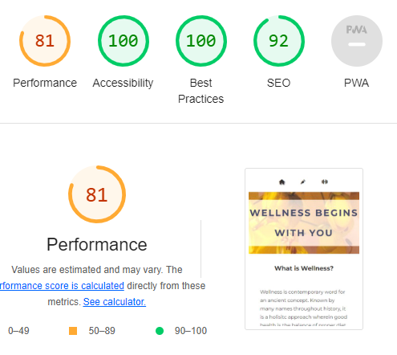

# Project 1 - Wellness


I wanted to create a website focused on wellness as it is a very recent and personal interest of mine. I have learned some self-care tips and wanted to compile them in a single place for anyone who would be interested in the topic. In order to share the information in an eye-catching way, I did need to go beyong the HTML and CSS essentials module I have completed at Code Institute. Mainly, I learned a lot about the use of flexboxes and animation. I've also discovered the importance of setting universal parameters and html font size (rem is my favorite thing at the moment). 


From the homepage, there are several ways to navigate to the two other pages including the navigation bar and the heading links.


The navigation bar has a responsive design which includes icons instead of text when the screen is small enough.

### Box-breathing Animation


When researching how to include a breathing exercise, I found animations on W3Schools. After becoming more familiar with the property I was advised to look into transform properties instead as a more efficient tool. I understand that animation uses more memory, however I felt I understood it better and so I have opted to use it and research transform for future use.

I did want to include the animation in the final project as I believe having a visual aid when learning to practice breathing techniques is invaluable for the user.

### Blog Recommendations


This is a list of well-known blogs that are user friendly with a clean design. They offer high quality recipes that support my vision for wellness and are perfect supplements to the site.

## Deployment
I used Gitpod to deploy the code. In settings for my Wellness project repository, I selected the main branch in the source section. The link was then generated publishing the website.

## Testing
As of date of publishing the page, all links both internal and external have been tested and work as expected.

## Validator Testing
No errors were returned when passed through both the W3C CSS validator and W3C HTML validator.



Lighthouse score is 100 in accessibility and best practices. SEO is 92 and performance is 81.

## Credits
W3Schools has been invaluable in expanding on topics I knew as well as having no knowledge in. Namely, introducing me to concepts of animation and flexbox.

CSS Tricks offered a very in depth description of flex including visual aides which really solidified my understanding.

Jonas Schmedtmann on Udemy offers a course on CSS that has been the perfect supplement to Code Institute and his desctriptions of how to use universal and html selectors helped me refine my code. I finally understand rem and how important of a tool it actual is in responsive design. Below is a snippet of code from the course I have implemented in my own code.
```css
html {
    font-size: 62.5%;
}
```

Freecodecamp has a great page on how to write up a meaningful README.md that I've used as reference so hopefully I've done it justice!

The first few iterations of this website included code from a project I built while following along with the tutorial at Code Institute. It was not my code but I used it for both reference and inspiration (sometimes even as stand-in code) as this project is my very first from the ground up. Because I have never worked with git, the idea of committing and pushing code was very new and I didn’t really think about what it was exactly I was pushing. At some point, you might see that I commented-out the code as I realized this unrelated information would show up in the history. I immediately remembered you should not push commented-out code so I removed it completely and it is now missing. Of course, I understand this is not best practice and have taken it as a learning moment that will influence what I commit/push in the future.

## Media Credits
All images that are not screenshots of my website are taken from [Pexels](https://www.pexels.com/)

I hope you enjoy my project!
