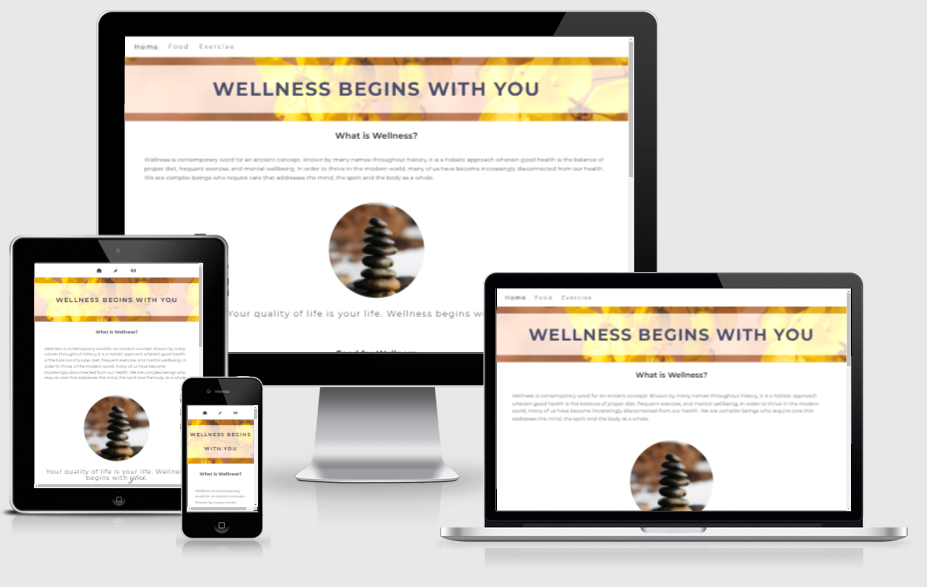
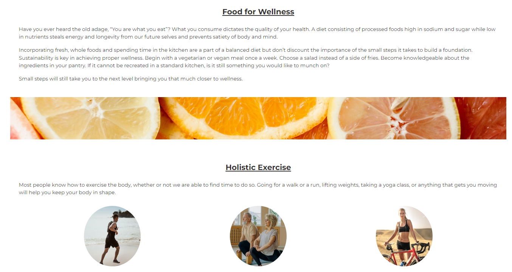
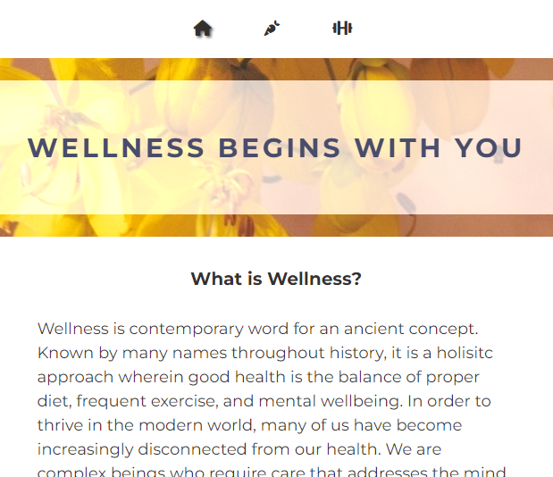
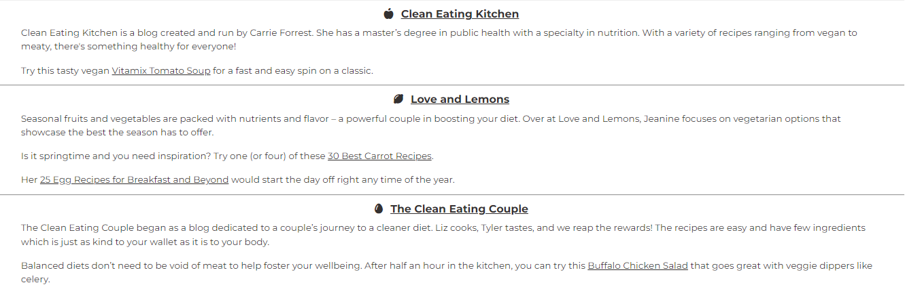
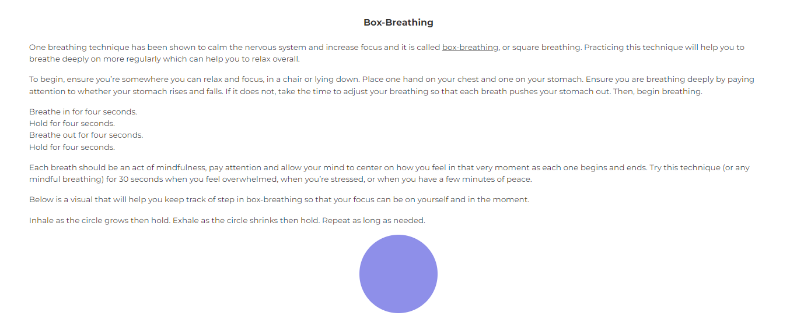

# Wellness Begins with You 

I wanted to create a website focused on wellness as it is a very recent and personal interest of mine. I have learned some self-care tips and wanted to compile them in a single place for anyone who would be interested in the topic.  

 

## Table of Contents 
* [Description](#description) 
* [Deployment](#deployment) 
* [Testing](#testing) 
* [Credits](#credits) 
 

## Description 

### Wireframe 

 

The vision for my project began more ambitiously with a separate page that would lead you into the homepage. I scrapped the idea as it seemed to contradict the suggestion that wellness should be simple to begin.  

### Final Iteration
 
In order to share the information in an eye-catching way, I did need to go beyond the HTML and CSS essentials module I have completed at Code Institute. Mainly, I needed to learn about the use of flexboxes and animation. I've also discovered the importance of setting universal parameters and html font size. 

Wellness Begins with You is a website dedicated to helping a beginner understand how to approach their health in a holistic way by taking small steps towards mindfulness and a better diet. From the homepage, readers learn about what wellbeing is and can read an overview of the other pages of the website. There are two points of navigation for each page from the homepage - the navigation bar and the headings at the top of each section. The nav bar is responsive and changes to icons on a smaller screen. 

 

 

The food page talks about how important the small steps are to building the foundation of a healthy diet. I’ve compiled three recommended blogs and offered a description of each as well as a selection of recipes to try. This is to create a sense of confidence in the reader that this is something achievable and doesn’t need to be done all at once. 

 

The exercise page discusses training the mind through mindful breathing techniques. I’ve listed the benefits as well as linked a resource to support those claims and went in depth about box-breathing. I’ve included an animation to use as a visual aid in timing the exercise and a description for how to use it. 
 

## Deployment 

Live link - 

[Wellness Begins with You](https://gnikroo.github.io/Wellness/) 

MY site was deployed to Github pages. In settings for my Wellness project repository, I selected the main branch in the source section. The link was then generated publishing the website. 

* From the GitHub repository, select settings  
* Click the pages link from the left-hand menu 
* In the source section drop-down menu, choose main branch  
* The page will then refresh with indicating successful deployment.  

## Testing 

As of date of publishing the page, all links both internal and external have been tested and work as expected. 

## Credits 

### Media 

* All images that are not screenshots of my website are taken from [Pexels](https://www.pexels.com/) 

### Content 

* Jonas Schmedtmann on Udemy offers a course on CSS that has been the perfect supplement to Code Institute and his descriptions of how to use universal and html selectors helped me refine my code. I finally understand rem and how important of a tool it actual is in responsive design. Below is a snippet of code from the course I have implemented in my own code. 

```css 
html { 
    font-size: 62.5%; 
} 
``` 

* The first few iterations of this website included code from a project I built while following along with the tutorial at Code Institute. It was not my code but I used it for both reference and inspiration (sometimes even as stand-in code) as this project is my very first from the ground up. Because I have never worked with git, the idea of committing and pushing code was very new and I didn’t really think about what it was exactly I was pushing. At some point, you might see that I commented-out the code as I realized this unrelated information would show up in the history. I immediately remembered you should not push commented-out code so I removed it completely and it is now missing. Of course, I understand this is not best practice and have taken it as a learning moment that will influence what I commit/push in the future. 

### Reference Material 

* W3Schools has been invaluable in expanding on topics I knew as well as having no knowledge in. Namely, introducing me to concepts of animation and flexbox. 

* CSS Tricks offered a very in-depth description of flex including visual aids which really solidified my understanding. 

* Freecodecamp has a great page on how to write up a meaningful README.md that I've used as reference so hopefully I've done it justice! 

### Acknowledgements 

* I would like to thank my husband, Nima Nikroo. As a senior programmer, his experience has been invaluable in suggesting what tools may be useful for my vision and breaking down the more complex topics so I may understand them better. 